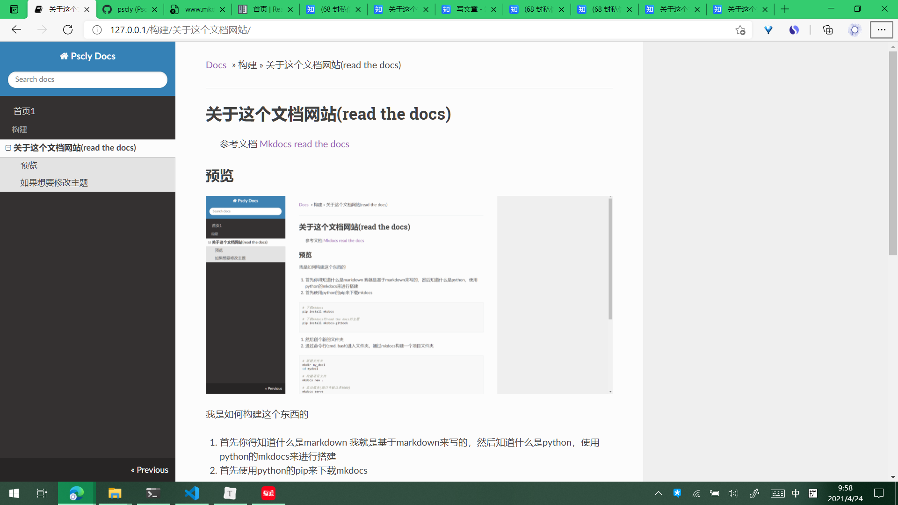

# 关于这个文档网站(read the docs)

> 参考文档
> [Mkdocs](https://www.mkdocs.org/)
> [read the docs](https://readthedocs.org/)

## 预览



我是如何构建这个东西的

1. 首先你得知道什么是markdown 我就是基于markdown来写的，然后知道什么是python，使用python的mkdocs来进行搭建
2. 首先使用python的pip来下载mkdocs

```bash
# 下载mkdocs
pip install mkdocs

# 下载mkdocs的read the docs的主题
pip install mkdocs-gitbook

```

3. 然后创个新的文件夹
4. 通过命令行(cmd, bash)进入文件夹，通过mkdocs构建一个项目文件夹

```bash
# 新建文件夹
mkdir my_doc1
cd mydoc1

# 构建项目文件
mkdocs new .

# 启动服务(端口号默认是8000)
mkdocs serve

# 如果想让别人也能访问你的服务(端口号修改为80)
mkdocs serve -a 0.0.0.0:80

```

## 如果想要修改主题

修改项目文件夹下面的 mkdocs.yml

```yml
theme:
    name: readthedocs
    highlightjs: true
    hljs_languages:
        - yaml
        - rust
```

## 然后就吧写好的md文件放到docs文件夹中，重启一下服务(mkdocs serve)就好了
